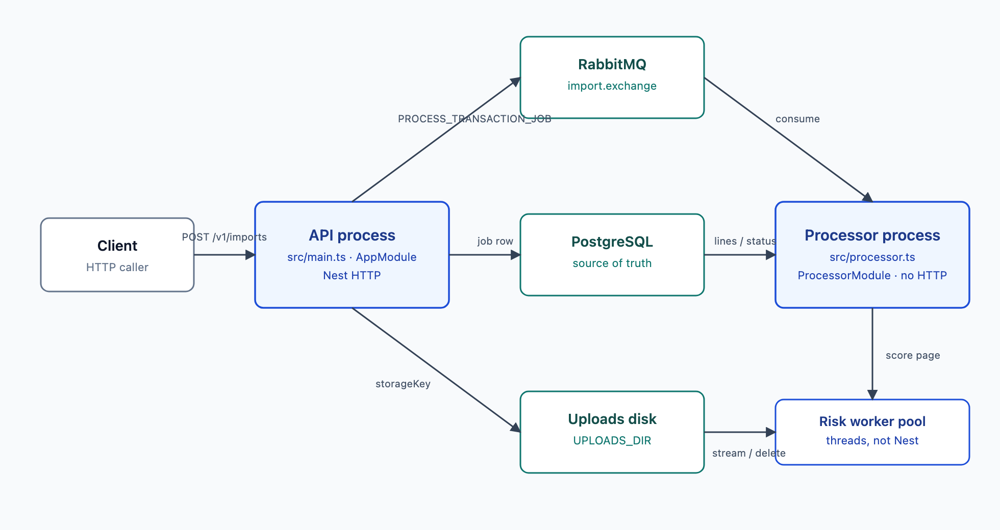
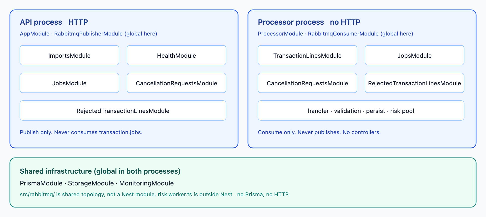
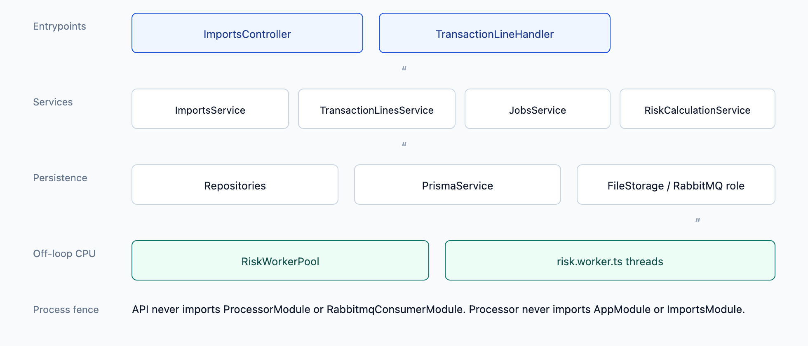
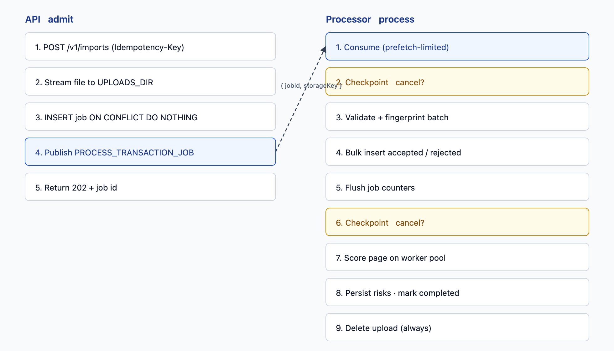

# Architecture

This service imports NDJSON transaction files, persists accepted lines, scores risk, and exposes job status and reconciliation. Heavy work never shares the API event loop: the HTTP process publishes a job, and a separate processor process consumes it.



## System components

Four runtime pieces, plus the two Nest applications that own them.

| Component                                                     | Role                                                                                                                  |
| ------------------------------------------------------------- | --------------------------------------------------------------------------------------------------------------------- |
| **API process** (`src/main.ts`, `AppModule`)                  | HTTP only. Accepts uploads, creates jobs, publishes messages, serves status / summary / rejections / cancel / health. |
| **Processor process** (`src/processor.ts`, `ProcessorModule`) | No HTTP. Consumes `PROCESS_TRANSACTION_JOB`, streams the file, validates, persists, scores risk, honors cancellation. |
| **PostgreSQL**                                                | Jobs, transaction lines, rejected lines, cancellation requests. Source of truth for progress and uniqueness.          |
| **RabbitMQ**                                                  | Durable topic exchange `import.exchange` bound to queue `transaction.jobs` on routing key `PROCESS_TRANSACTION_JOB`.  |
| **Uploads disk**                                              | Shared directory (`UPLOADS_DIR`). Multer streams the file here; the processor streams it back by `storageKey`.        |

The API and processor share one codebase and the same Postgres, RabbitMQ, and uploads root. They do not share a Node event loop, memory, or a RabbitMQ consumer.

The processor boots a Nest application context (no HTTP server). On start it may delete stale uploads, then waits for queue deliveries. Risk scoring runs inside that process on a fixed worker-thread pool, not on the main thread.

## Module boundaries

Nest modules are the composition root. Infrastructure that both processes need is global; feature modules stay local to the process that uses them.



**Shared infrastructure (global)**

| Module             | Provided to                            |
| ------------------ | -------------------------------------- |
| `PrismaModule`     | Both — one `PrismaService` per process |
| `StorageModule`    | Both — same `UPLOADS_DIR` contract     |
| `MonitoringModule` | Both — event-loop logs only            |

**API-only**

- `RabbitmqPublisherModule` (global in this process): publish, never consume
- `ImportsModule`: HTTP surface for imports
- `HealthModule`: `/health/live` and `/health/ready`
- `JobsModule`, `CancellationRequestsModule`, `RejectedTransactionLinesModule`: domain services used by imports

**Processor-only**

- `RabbitmqConsumerModule` (global in this process): consume, never publish
- `TransactionLinesModule`: handler, validation, persist, risk pool
- Same `JobsModule` / `CancellationRequestsModule` / `RejectedTransactionLinesModule` as the API, for writes the handler owns

A module that owns a table exports its **service**, not its repository. Controllers and handlers talk to services. Repositories talk only to `PrismaService`.

The one exception: `ImportsModule` registers `TransactionLinesRepository` itself so summary aggregations can run in the API without importing `TransactionLinesModule` (which would pull in the processor handler and the worker pool).

RabbitMQ is split into two modules on purpose. The API process must not consume a queue it has no handler for. Shared topology code lives in `src/rabbitmq/` (config, connection, message contract) and is not a Nest module.

Worker threads (`risk.worker.ts`) are outside Nest. They have no Prisma, no HTTP, and no module graph — only a risk heuristic plus simulated CPU work.

## Dependency direction

Dependencies point inward toward persistence and outward toward process entrypoints. Feature modules do not import each other in a cycle.



Rules that keep this direction:

- Controllers depend on one service (`ImportsController` → `ImportsService`).
- `ImportsService` depends on other **services** (jobs, cancellation, rejections, publisher, storage) plus the transaction-lines repository for read-side aggregations.
- `TransactionLineHandler` depends on services, not on HTTP types or `ImportsModule`.
- `TransactionLinesService` depends only on `TransactionLinesRepository`.
- Repositories depend only on `PrismaService`.
- `RiskCalculationService` depends on `RiskWorkerPool`; the pool talks to worker threads, not to Nest or the database.
- Config is read from `process.env` at the edge (`getRabbitmqConfig`, batch-size helpers). Domain code does not load dotenv.

The processor never imports `AppModule` or `ImportsModule`. The API never imports `ProcessorModule` or `RabbitmqConsumerModule`. That is the process boundary in the module graph.

## Dependency-injection strategy

Everything that lives in a Nest process is constructor-injected. There is no service locator in application code.

**Composition**

- Each process has one root module (`AppModule` or `ProcessorModule`) that imports the modules that process needs.
- `@Global()` is reserved for true process-wide singletons: Prisma, file storage, and that process’s RabbitMQ role.
- Feature modules export services. Repositories stay private to the module that owns the table.

**Lifecycle, not a bus**

The consumer does not discover handlers by scanning. `TransactionLineHandler` implements `OnModuleInit` and **registers** a callback on `RabbitmqConsumerService`. Consumption starts in `OnApplicationBootstrap`, after every `onModuleInit` has run, so a delivery cannot arrive before a handler exists. If none is registered, the processor refuses to consume.

Other lifecycle uses:

| Hook                        | Who                                       | Why                                                    |
| --------------------------- | ----------------------------------------- | ------------------------------------------------------ |
| `OnModuleInit`              | Prisma, storage, publisher, handler       | Connect, mkdir, assert topology, register handler      |
| `OnApplicationBootstrap`    | Consumer, monitoring                      | Start consume (with prefetch), start log interval      |
| `OnModuleDestroy`           | Prisma, RabbitMQ, worker pool, monitoring | Disconnect, terminate threads, clear timers            |
| `BeforeApplicationShutdown` | Health                                    | Flip readiness so `/health/ready` fails while draining |

**What is not injected**

- Worker threads are spawned by `RiskWorkerPool`. The calculation script is a file path, not a Nest provider.
- Environment config is plain functions, not `ConfigModule`.
- The message contract (`ProcessTransactionJobMessage`) is a typed payload validated at the consumer edge before any handler runs.

## Processing workflow

An import is accepted before it is processed. `POST /v1/imports` returns 202 with the job id; the client polls status or summary.



**Validation batch.** The handler reads the file with `readline` so memory tracks batch size, not file size. Each line is checked for emptiness, max bytes, JSON, then normalize-and-validate. Failed lines become `RejectedTransactionLine` rows. Passed lines are fingerprinted and inserted together.

**Risk page.** After the file is fully persisted, the handler pages `transaction_lines` for that job (`createdAt`, `id`) and submits each page to the worker pool. Scores are written before the next page is loaded.

**Completion.** The job is `completed` only after risk finishes (or `cancelled` at a checkpoint). The upload is always removed in a `finally` so a failed or cancelled job does not leave the file on disk.

**Poison messages.** Invalid JSON or a payload that fails the wire contract is `nack`ed without requeue. A thrown handler error is the same: logged and dropped, not retried forever. An unclean process crash leaves the message unacked, so RabbitMQ redelivers it.

## Database consistency strategy

Postgres is the source of truth. The queue is a delivery mechanism, not a second ledger. Consistency is enforced with unique constraints and small write windows, not one transaction around the whole import.

**Job identity.** `jobs.idempotencyKey` is unique. Create uses:

```sql
INSERT INTO jobs (id, idempotencyKey, status, startedAt)
VALUES (gen_random_uuid(), $key, 'processing', NOW())
ON CONFLICT (idempotencyKey) DO NOTHING
RETURNING *
```

Concurrent `POST /v1/imports` with the same key produce one row. The winner publishes; the loser sees an empty `RETURNING` set, loads the existing job, and deletes its extra upload.

**Accepted lines.** `transaction_lines.fingerprint` and `transaction_lines.transactionId` are globally unique. Batch insert uses `createManyAndReturn` with `skipDuplicates: true`. Rows that collide on either unique key are skipped; the handler counts duplicates as `attempted − inserted`. There is no application-level lock around the file.

**Rejected lines.** Unique on `(jobId, lineNumber)`. Inserts also use `skipDuplicates`, so a redelivered job cannot double-write the same line number.

**Progress counters.** `processed` / `accepted` / `rejected` / `duplicates` live on the job. The handler keeps them in memory during validation, then writes them once before risk. A cancel during validation persists whatever has been counted so far. Summary totals read these counters; breakdowns (`GROUP BY` currency / merchant / account, risk buckets) are computed in SQL at request time so they cannot drift from stored lines.

**Risk writes.** Each page of scores is applied in a Prisma `$transaction` of per-row updates. A page is durable before the next page is fetched. A crash after a page commit leaves those scores; a later redelivery would skip duplicate inserts and continue scoring remaining rows (risk is nullable until set).

**What is not a single transaction.** One import is many batches. That is intentional: a 500k-line file cannot sit in one uncommitted transaction. The job status (`processing` → `completed` / `cancelled`) is the client-visible fence. `transaction_lines.jobId` uses `onDelete: Restrict` so a job with lines cannot be removed out from under them.

**Uploads vs rows.** The API deletes the file if job create or publish fails. The processor deletes it after handling. A sweeper on processor boot removes leftover files older than `UPLOADS_RETENTION_HOURS`. Storage keys are UUID + extension only; the processor never trusts a path from the queue.

## Cancellation strategy

Cancel is cooperative and checkpointed. The API never kills the processor; it records intent. The processor stops between units of work.

**API (`POST /v1/imports/:id/cancel`)**

1. Load the job (404 if missing).
2. Allow only `pending` or `processing`. Anything else is 400.
3. Insert a `CancellationRequest` (unique `jobId`). A second create is a no-op at the service layer; in practice the status check already rejects once the job is `cancelling`.
4. Set job status to `cancelling`.
5. Return 202. The job is not `cancelled` yet.

**Processor checkpoints**

The handler polls `cancellation_requests` **before** the next validation batch and **before** the next risk page. It never aborts a batch that has already started.

- **During validation:** persist `cancelled`, `completedAt`, and counts so far. Lines sitting in the in-memory batch are dropped, not written.
- **During risk:** persist `cancelled` and `completedAt`. Scores already written stay.

The handler then returns normally so the queue message is acked. Stop delay is bounded by one validation batch or one risk page.

```
stream → [checkpoint] → validate+insert batch → … → flush counts
      → [checkpoint] → score+update risk page → … → completed
```

## Duplicate-detection strategy

“Same payment” is not “same JSON line” and not “same `transactionId`.” Client ids and descriptions often change on retry.

Each accepted line gets a SHA-256 fingerprint over **normalized** fields, in this order, null-byte separated:

| Field        | Normalization                             |
| ------------ | ----------------------------------------- |
| `accountId`  | trimmed, NFC, control characters stripped |
| `merchantId` | same                                      |
| `amount`     | exact two decimal places (`toFixed(2)`)   |
| `timestamp`  | UTC ISO-8601 (`Date.toISOString()`)       |

Left out on purpose: `transactionId` (retries mint new ids), `description` (cosmetic), `currency` (the four fields already identify the event for this pipeline).

The hash is stored in `transaction_lines.fingerprint` (`CHAR(64)`, unique). Inserts use `skipDuplicates`. Two lines that are the same payer, payee, amount, and moment collide even across jobs. `transactionId` uniqueness is a second net for exact id reuse.

Duplicates are not written as rejected rows. They are counted as `passed.length - inserted.length` for that batch and rolled into the job’s `duplicates` counter.

## Event-loop protection

The API stays responsive because import work is not on its loop. Additional guards keep each process from blocking itself.

**Process split.** Parsing, validation, fingerprinting, persistence, and risk never run in the API process. `GET /health/*`, status, cancel, summary, and rejection paging stay off the heavy path.

**Uploads.** Multer uses disk storage, not memory. JSON/urlencoded bodies are capped at 16 KB; the NDJSON payload never goes through `JSON.parse` in the API.

**Bounded CPU on the processor main thread.** `JSON.parse` and validation run per batch (`IMPORT_BATCH_SIZE`). Each `await` (insert, cancel check, risk page) yields. Line size is capped (`IMPORT_MAX_LINE_BYTES`) so a single huge line cannot dominate parse time or memory.

**Risk off the main thread.** Scoring (heuristic plus simulated model CPU) runs on a pool of `availableParallelism() - 2` workers. The main thread only posts payloads and writes results. A 100k-line file does not create 100k threads.

**Monitoring is logs, not an endpoint.** Both processes sample event-loop delay, utilization, CPU, and heap on an `unref`’d interval. There is no `/metrics` route, so scraping cannot compete with request handling.

**Readiness vs liveness.** `/health/live` means the process is up. `/health/ready` means the HTTP server has bootstrapped, is listening, and is not shutting down. Postgres and RabbitMQ readiness are owned by Compose healthchecks, not by request-path probes.

## Backpressure strategy

Load is shed at every stage so a large file or a burst of imports cannot unbounded-grow memory, threads, or unacked messages.

| Layer                 | Mechanism                                                                                                                                                                                         |
| --------------------- | ------------------------------------------------------------------------------------------------------------------------------------------------------------------------------------------------- |
| **HTTP upload**       | Max 100 MB, one file, NDJSON extension/MIME only. Extra multipart parts and field sizes are capped.                                                                                               |
| **Queue depth**       | Persistent publish to a durable queue. The API does not wait for processing.                                                                                                                      |
| **In-flight jobs**    | Consumer `prefetch` (`RABBITMQ_PREFETCH`, default 5). The processor takes at most that many unacked jobs.                                                                                         |
| **Ack policy**        | `noAck: false`. The next job is not considered done until the handler returns. Broker consumer timeout (`RABBITMQ_CONSUMER_TIMEOUT_MINUTES`) bounds how long a stuck handler can hold a delivery. |
| **File stream**       | `for await` of readline only continues after the current batch is flushed. The reader cannot race ahead of Postgres.                                                                              |
| **Validation memory** | Batch size caps the working set. The array is cleared after each insert.                                                                                                                          |
| **Risk memory**       | Page size (`RISK_BATCH_SIZE`) caps how many lines and pending worker tasks exist at once. Scores are persisted before the next page.                                                              |
| **CPU**               | Worker pool queues tasks when all threads are busy. It does not spawn extra threads.                                                                                                              |
| **API reads**         | Rejection listing is cursor-paged (max 500). Summary aggregations run in SQL and return grouped rows, not every line.                                                                             |

Together: the HTTP process admits work quickly and bounded, the queue absorbs bursts, the processor pulls a small number of jobs, and each job proceeds in windows that the database and the worker pool can finish before the next window starts.
