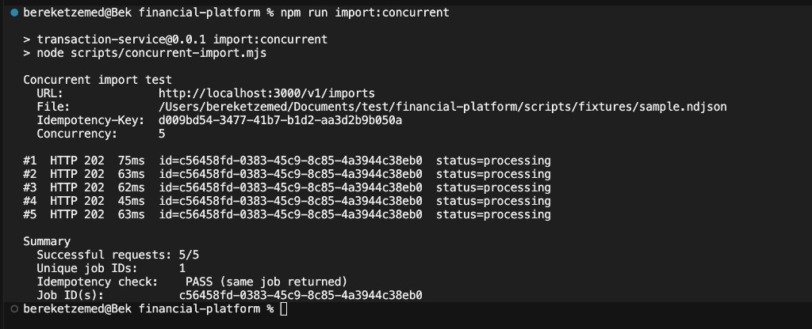
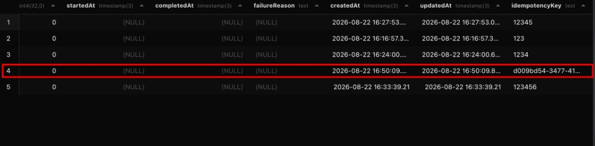

# Concurrent Import Idempotency Test

This document records a manual verification of the `POST /v1/imports` idempotency behavior under concurrent load.

## What we are testing

The assignment requires that:

- `Idempotency-Key` is required
- Repeating a request with the same key must not create another import
- Concurrent requests using the same key must not create duplicate imports

The script `scripts/concurrent-import.mjs` sends multiple parallel requests to `POST /v1/imports` using the **same NDJSON file** and the **same `Idempotency-Key`**.

## How to run locally

### 1. Start PostgreSQL

```bash
docker compose up -d postgres
```

### 2. Apply migrations

```bash
npm run migrate:deploy
```

### 3. Start the API

```bash
npm run start:dev
```

The API listens on `http://localhost:3000`.

### 4. Run the concurrent import test

Default run (5 parallel requests, random idempotency key, sample fixture):

```bash
npm run import:concurrent
```

Custom concurrency and idempotency key:

```bash
npm run import:concurrent -- -n 5 -k d009bd54-3477-41b7-b1d2-aa3d2b9b050a
```

Use your own NDJSON file:

```bash
npm run import:concurrent -- --file ./path/to/file.ndjson -n 10 -k my-test-key
```

### 5. Inspect the database (optional)

Open Prisma Studio:

```bash
npm run db:studio
```

Or query the `jobs` table directly:

```bash
docker exec financial-platform-postgres psql -U postgres -d financial_platform \
  -c 'SELECT id, "idempotencyKey", status, "createdAt" FROM jobs ORDER BY "createdAt" DESC;'
```

## Expected result

All concurrent requests should:

- return **HTTP 202**
- return the **same job `id`**
- create **only one row** in the `jobs` table for that idempotency key

The script prints a summary line:

```text
Idempotency check: PASS (same job returned)
```

## Test run (2026-08-22)

### Terminal output

Five parallel requests were sent with concurrency `5` and idempotency key `d009bd54-3477-41b7-b1d2-aa3d2b9b050a`.



Observations:

- All 5 requests returned **HTTP 202**
- All 5 responses contained the same job id: `c56458fd-0383-45c9-8c85-4a3944c38eb0`
- Script summary: `Successful requests: 5/5`, `Unique job IDs: 1`, `Idempotency check: PASS`

### Database verification

After the test, the `jobs` table contained a single row for idempotency key `d009bd54-3477-41b7-b1d2-aa3d2b9b050a`.



This confirms that concurrent requests with the same key did not create duplicate import jobs.

## Script options

| Flag | Description | Default |
|------|-------------|---------|
| `-n`, `--concurrency` | Number of parallel requests | `5` |
| `-k`, `--idempotency-key` | Shared `Idempotency-Key` header | random UUID per run |
| `--file` | NDJSON file to upload | `scripts/fixtures/sample.ndjson` |
| `--url` | Import endpoint URL | `http://localhost:3000/v1/imports` |
| `-h`, `--help` | Show usage | — |

## Implementation notes

Idempotency is enforced at the database layer via a unique constraint on `jobs.idempotencyKey`. `JobsRepository.findOrCreateByIdempotencyKey` handles concurrent inserts by catching Prisma error `P2002` and returning the existing job row.
